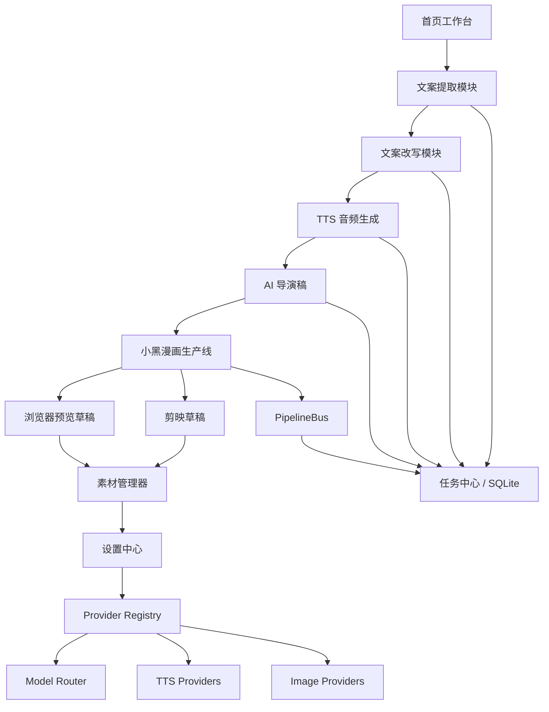

# 产品技术方案与开发路线图

更新时间：2026-07-12

## 1. 已确认目标

本项目定位为个人创作者的短视频生产工作台。当前阶段优先服务一个人使用，
但架构上保留以后扩展到多设备、多账号、多平台发布的空间。

已经确认的第一优先级：

- 长期方向：完整产品级系统，不只做一次性脚本。
- 当前使用者：个人使用。
- 内容来源：既支持平台链接二创，也支持从主题/文案原创。
- 发布平台：长期兼顾抖音、小红书、视频号、B 站、YouTube。
- 第一条主生产线：抖音链接优先。
- 第一条视频风格：小黑漫画解释类。
- 默认画幅：16:9。
- 默认时长：30 秒左右。
- 第一阶段输出：浏览器可预览的视频草稿 + 剪映草稿。
- 最终目标：尽量做到一键生成可发布视频，但当前阶段允许先产出高质量草稿。
- API 前提：大模型、阿里云百炼/DashScope、TTS、图片生成等 Key 基本具备。
- 同步规则：每次完成可交付修改后运行测试、提交并 push 到 GitHub。

## 2. 产品总览

系统应收束为一条清晰的创作链路：

```text
首页引导
→ 平台链接采集
→ 视频/音频/文案提取
→ 文案分析与改写
→ TTS 语音生成
→ AI 导演稿与分镜
→ 小黑漫画图文/素材规划
→ 浏览器预览草稿
→ 剪映草稿
→ 素材管理与复用
→ 多平台发布适配
```

长期产品不是把所有功能平铺在页面上，而是把每个模块做成可以独立使用、
也可以被生产线自动串联的能力。

## 3. 现有代码基础

当前仓库已经具备较好的基础能力，应优先复用而不是重写：

- 本地 UI 服务：`ui-server.mjs`
- 前端入口：`ui/index.html`、`ui/app.js`、`ui/workbench.js`
- 模块化前端目录：`ui/modules/`
- 多平台内容 Adapter：`server/core/adapters/`
- 内容分析与标准化：`server/core/content/`
- 模型路由：`server/core/model-router/`
- Provider 注册：`server/core/provider-registry.js`
- 设置中心：`server/core/settings-center.js`
- 任务中心：`server/core/task-center.js`
- PipelineBus：`server/core/pipeline-bus/`
- TTS 服务：`server/tts/`
- 声音资产服务：`server/voices/voice-asset-service.js`
- 图片服务：`server/image/`
- AI 导演系统：`server/director/director-service.js`
- VFO：`server/vfo/vfo-service.js`
- 成片中心：`server/video-product/video-product-service.js`
- 小黑视频风格生成接口：`server/routes/ian-xiaohei-routes.js`
- 成片输出接口：`server/routes/video-output-routes.js`
- 项目知识与规则：`skills/`、`prompts/`、`config/`

已有文档中，`docs/video-output-roadmap.md` 已明确“剪映模板草稿”为默认主路线。
本路线图在此基础上继续扩展整体产品，不推翻已有方向。

## 4. 目标架构



架构原则：

- 前端只负责选择、预览、触发任务和展示状态。
- API Key、Secret、Cookie、Token 只进入本地 `settings.json`，不进入 Git。
- AI、TTS、图片、剪映导出都走后端 service 或 adapter。
- 生产线状态写入 SQLite，前端不保存关键业务状态。
- `skills/` 固化专业规则，`prompts/` 固化模型提示词，`config/` 固化可配置预设。
- 新功能优先接入 PipelineBus，而不是在页面里串异步逻辑。

## 5. 模块方案

### 5.1 首页模块

目标：成为个人创作者的“生产总控台”。

核心能力：

- 展示当前项目状态：已采集、已提取、已改写、已配音、已生成导演稿、已生成草稿。
- 每个模块操作时显示进度百分比和当前步骤。
- 悬浮引导支持点击步骤跳转到对应模块。
- 一键继续上次任务。
- 一键启动第一条主生产线：抖音链接 → 小黑漫画视频草稿。

技术落点：

- 复用 `ui/workbench.js` 当前项目轨道。
- 用 `server/core/workflow-state.js` 和 PipelineBus 统一状态。
- 后续把首页状态从零散 DOM 更新收束为统一 `GET /api/workflow/status`。

### 5.2 文案提取模块

目标：支持多平台输入，但第一阶段抖音优先。

核心能力：

- 基于现有 adapter 体系统一平台输入。
- 第一阶段支持抖音链接解析、视频下载、音频提取、文案提取。
- 长期支持小红书、B 站、YouTube、网页、本地视频、PDF。
- 功能选择：下载视频、提取文案、提取音频。
- 文案格式选择：纯文本、带时间戳、分段文案、字幕格式。
- 音频格式选择：默认 mp3，后续扩展 wav/m4a。
- 提取后支持文案预览、一键复制、一键发送到改写模块。
- 支持打开下载资源目录。

技术落点：

- 复用 `server/core/adapters/douyin-adapter.js` 等 adapter。
- 复用 `ui/modules/transcript.js` 和 `ui/modules/legacy-runtime.js` 中已有入口。
- 提取结果统一写入任务中心和 copybank。
- 后续接入 yt-dlp 时，不直接写在前端，封装为 `server/core/adapters/generic-url-adapter.js`
  或独立 downloader service。

### 5.3 文案改写模块

目标：把原始文案改造成适合多平台、多风格、多生产线的脚本。

核心能力：

- 模型选择：自动、阿里云百炼、DeepSeek、Qwen、OpenAI、Gemini、Claude、火山等。
- 风格选择：口播、视频文案、小黑解释、朋友圈图文、招生/知识/职场等。
- 字数建议：默认按 30 秒生成 120-180 中文字，可手动调整。
- 接入 scale 优化：用于评分、压缩、增强钩子、降低废话密度。
- 朋友圈分支：支持人设、固定风格、图文生成。
- 多 skill 可选：小黑、多角色 IP、humanizer、平台策略等。
- 支持草稿预览、审核、保存版本。

技术落点：

- 复用 `server/config/rewrite-presets.js`。
- 复用 `prompts/rewrite_pipeline.md`、`prompts/score_rewrite.md`。
- 改写版本进入 copybank，不只存在前端。
- “发送到导演稿 / 发送到 TTS / 发送到小黑生产线”要成为显式动作。

### 5.4 TTS 音频生成模块

目标：把视频脚本稳定转为可复用、可管理的配音资产。

核心能力：

- 接入阿里云百炼 CosyVoice / Qwen-TTS。
- 接入米家 API 时走 provider adapter，不写死到前端。
- 保留火山、腾讯、MiniMax、Fish Audio、ElevenLabs 等扩展。
- 约 20 个预设语音，允许隐藏/删除。
- 支持克隆自定义语音，但必须确认用户拥有合法授权。
- 生成选项可保存并命名。
- 自动保存历史音频、试听、评分、最近使用。

技术落点：

- 复用 `server/tts/tts-service.js` 和 `server/tts/providers/`。
- 复用 `server/voices/voice-asset-service.js`。
- 所有声音资产默认保存到本机 `voices/` 和 SQLite，不上传 GitHub。
- 生成前必须经过 TTS 清洗 Prompt：切句、停顿、情绪、口播节奏。

### 5.5 小黑漫画解释类生产线

目标：第一条完整生产线，优先打通“抖音链接自动提取文案 → 小黑视频草稿”。

默认流程：

```text
抖音链接
→ 下载/提取音频
→ ASR 文案
→ 改写为 30 秒小黑解释稿
→ 生成导演稿和 storyboard
→ 生成 Xiaohei 2.0 镜头提示与 VFX 合约
→ 浏览器可预览草稿
→ 剪映草稿/素材包
```

默认参数：

- 画幅：16:9。
- 时长：约 30 秒。
- 镜头数：5-6 个。
- 风格：Ian 白底手绘结构线 + Xiaohei 2.0 原创可爱 3D 动画潮玩主角。
- 输出：浏览器预览草稿 + 剪映草稿。

技术落点：

- 使用 `ui/xiaohei-illustrations.html` 作为小黑视频风格生成工作台。
- 使用 `ui/modules/ian-xiaohei-app.js` 承载小黑配图软件的完整前端能力。
- 复用 `server/routes/ian-xiaohei-routes.js` 的小黑配图、TTS、音乐素材、声音克隆和剪映草稿能力。
- 后续把它接入统一生产线，而不是只作为独立工具页。
- 浏览器预览和剪映草稿要共享同一份 storyboard、字幕、音频、素材清单。

### 5.6 生产线模块

长期保留三条生产线：

1. 纯文字视频线：文案 + 音频 + 时间轴 + 分镜，生成文字动效视频。
2. 小黑/图文视频线：文案 + 音频 + 小黑或其他 skill，生成图文解释视频。
3. 免费素材混剪线：通过独立 MoneyPrinterTurbo 服务生成免费素材混剪视频。

实现原则：

- 三条线都必须支持草稿预览。
- 生产线只编排流程，不直接写死 Provider 逻辑。
- 每个阶段都要有可暂停、可重试、可查看日志的任务状态。
- 第三条线需要先评估开源协议、素材版权、Windows 兼容性和维护成本。

### 5.7 素材管理器模块

目标：让所有生成和导入的素材可检索、可复用、可追踪来源。

核心能力：

- 按生产线分类：提取素材、配音、图片、分镜、BGM、剪映草稿、预览视频。
- 按日期、标签、平台、项目、状态搜索。
- 支持打开本地文件位置。
- 支持标记收藏、废弃、可复用、待审核。
- 每个素材记录来源：平台链接、任务 ID、改写版本、导演稿 ID、生成 Provider。

技术落点：

- 复用 `server/core/asset-stores/`。
- 图片、视频、音频、导演稿、字幕、剪映草稿走统一 asset record。
- 大体积素材继续保存在本地忽略目录，不提交 GitHub。

### 5.8 设置模块

目标：成为所有 API、路径、Provider、生产线默认值的统一管理中心。

核心能力：

- 管理模型 API：添加、更新、测试连接、选择默认模型。
- 管理 TTS API：Provider、语音、克隆设置、默认语音。
- 管理图片生成 API：即梦、火山 Ark 等。
- 管理剪映路径、草稿目录、模板母版目录。
- 管理默认生产线参数：平台、画幅、时长、风格、BGM、输出模式。

技术落点：

- 复用 `server/core/settings-center.js`。
- 敏感信息只写 `settings.json`。
- 设置页只显示脱敏信息。
- 设置变更要有“测试连接”能力，避免进入生产线后才失败。

## 6. 数据与状态设计

核心实体：

| 实体 | 用途 | 存储建议 |
| --- | --- | --- |
| Task | 平台链接、下载、提取、改写等任务 | SQLite |
| Transcript | 文案、时间戳、ASR 元数据 | SQLite + 本地文件 |
| RewriteVersion | 改写版本、评分、风格、模型 | SQLite / copybank |
| AudioJob | TTS 任务、音频路径、语音参数 | SQLite + voices/ |
| DirectorProject | 导演稿、storyboard、字幕时间线 | SQLite + docs/.data |
| AssetPackage | 图片/视频/BGM/字幕/草稿素材包 | SQLite + 本地素材目录 |
| VideoProduct | 预览草稿、剪映草稿、输出历史 | SQLite + jianying-exports/ |
| SettingProfile | API、路径、生产线默认值 | settings.json |

状态机建议：

```text
created
→ queued
→ running
→ needs_review
→ completed
→ failed
→ archived
```

每个状态应包含：

- 当前步骤。
- 百分比。
- 最近日志。
- 输入来源。
- 输出文件。
- 可重试动作。

## 7. API 边界

后续拆分 API 时建议保持这些业务边界：

- `/api/collector/*`：平台链接、下载、音频提取。
- `/api/transcript/*`：ASR、文案格式、字幕格式。
- `/api/rewrite/*`：改写、评分、版本保存。
- `/api/tts/*`：语音生成、试听、重试、声音资产。
- `/api/director/*`：导演稿、storyboard、导出。
- `/api/ian-xiaohei/*`：小黑视频风格生成、TTS、音乐素材、配图、输出记录和剪映草稿。
- `/api/money-printer/*`：MoneyPrinterTurbo 服务检测、启动、任务提交、进度轮询和输出打开。
- `/api/video-product/*`：浏览器预览、剪映草稿、素材包、输出记录。
- `/api/assets/*`：素材库检索、标签、打开文件。
- `/api/settings/*`：Provider、路径、默认配置。

已有 `server/routes/README.md` 提到 `ui-server.mjs` 继续作为稳定入口。
因此 API 拆分应渐进完成：一个模块迁移、一个模块测试通过，再从
`ui-server.mjs` 移除对应内联路由。

## 8. 开发路线图

### P0：本地项目基线

状态：已完成。

- 克隆仓库到 `D:\cs1\dy`。
- 安装 pnpm 依赖。
- 跑通本地服务 `http://127.0.0.1:8787`。
- `pnpm run check` 通过。
- E2E 和核心测试通过。

### P1：统一产品骨架

目标：让首页、进度条、悬浮引导和当前项目状态可用。

交付：

- 首页展示完整生产链路。
- 每个模块卡片显示当前状态、最近产物、下一步动作。
- 悬浮步骤导航可跳转到对应模块。
- 统一项目状态从 PipelineBus/SQLite 读取。
- 形成第一版“当前项目”概念。

验收：

- 打开首页能看到链路状态。
- 点击步骤能定位模块。
- 任一模块执行任务时能显示百分比和当前步骤。

### P2：抖音链接到文案提取

目标：打通第一生产线输入端。

交付：

- 抖音链接解析、下载、音频提取、ASR 文案提取。
- 文案预览、复制、格式切换。
- 一键发送到改写模块。
- 打开下载目录。

验收：

- 输入抖音链接后能得到可读文案。
- 文案能进入改写模块并保留来源任务 ID。

### P3：小黑解释稿改写

目标：把原始文案稳定改成 30 秒小黑解释稿。

交付：

- 增加“小黑解释类 30 秒”改写预设。
- 字数建议 120-180 字，可手动调整。
- 输出 hook、痛点、冲突、行动建议、CTA。
- 支持审核、保存、发送到小黑生产线。

验收：

- 改写结果适合 5-6 个镜头。
- 前 3 秒有明确钩子。
- 没有凭空编造来源文案没有的数据。

### P4：TTS 配音资产

目标：让小黑生产线拥有可控配音。

交付：

- 小黑生产线可选择默认语音。
- 生成 30 秒左右音频。
- 语音参数可保存为方案。
- 音频进入素材管理器。

验收：

- 改写稿能一键生成配音。
- 音频路径能被后续预览草稿和剪映草稿复用。

### P5：小黑浏览器预览草稿

目标：第一条生产线能端到端生成可预览草稿。

交付：

- 抖音文案/改写稿进入小黑生成器。
- 默认 16:9、约 30 秒、5-6 镜头。
- 生成 director-script、storyboard、image-prompts、VFX contract。
- 浏览器预览可打开。
- 每个镜头显示字幕、角色动作、关键图文元素。

验收：

- 一条抖音链接最终可生成可预览的小黑解释视频草稿。
- 产物能在本地打开检查。
- 草稿记录进入当前项目。

### P6：剪映草稿主路线

目标：把浏览器预览草稿转为可继续编辑的剪映草稿。

交付：

- 小黑 storyboard、字幕、音频、素材包进入 `video-product`。
- 默认输出剪映模板草稿。
- 缺少 capcut-cli 或母版时降级为兼容素材包。
- 支持打开剪映。

验收：

- 能看到剪映草稿路径或兼容素材包路径。
- 缺少本地工具时任务不崩溃，明确提示缺少什么。

### P7：素材管理器

目标：所有产物可复用。

交付：

- 按生产线、日期、标签、类型搜索。
- 支持打开文件位置。
- 支持预览图片/音频/视频。
- 素材来源可追踪到任务、文案、改写版本、导演稿。

验收：

- 能从素材库找到最近一次小黑生产线的所有产物。

### P8：多平台与多生产线扩展

目标：从单条主线扩展到完整系统。

交付：

- 小红书、B 站、YouTube 输入链路。
- 纯文字视频生产线。
- 朋友圈图文分支。
- MoneyPrinterTurbo 免费素材混剪线：独立页面、API 启动、任务提交、进度轮询和 MP4 输出入口。
- 多平台标题、封面、字幕、画幅适配。

验收：

- 同一文案能选择不同平台输出策略。
- 不同生产线共享素材、设置和项目状态。

## 9. 质量门槛

每个阶段都必须满足：

- 不破坏现有下载、文案提取、AI 改写、TTS、SQLite、剪映输出能力。
- API Key 和本地素材不进入 GitHub。
- 每次开发前 `git pull --ff-only origin main`。
- 每次完成后运行相关测试。
- 每次可交付修改都提交并 push。

建议测试组合：

```powershell
pnpm run check
pnpm run test:e2e
pnpm run test:pipeline
pnpm run test:provider-registry
pnpm run test:http-body
```

涉及 TTS、图片、剪映、下载的功能，还需要人工冒烟测试，因为它们依赖本地路径、
API Key、网络和外部软件。

## 10. 风险与处理

| 风险 | 处理方式 |
| --- | --- |
| 抖音平台解析规则变化 | Adapter 化，失败时保留手动导入和本地视频入口 |
| API Key 泄露 | 只写 `settings.json`，日志和导出脱敏 |
| 剪映草稿兼容性不稳定 | 默认兼容素材包，模板命令模式作为增强 |
| 小黑角色风格不稳定 | 固化 Xiaohei 2.0 身份、镜头动作和质量检查 |
| 生成视频质量不足 | 先浏览器预览和人工审核，再逐步提高自动化 |
| 多平台同时推进导致发散 | 第一阶段只打通抖音 + 小黑 16:9 30 秒 |
| 素材版权风险 | 免费素材混剪线先做技术验证和来源记录，不自动发布 |

## 11. 最近开发顺序建议

下一步建议按这个顺序推进：

1. 做首页总控台和悬浮引导，让所有模块有统一入口。
2. 把抖音链接 → 文案提取 → 改写 → 小黑生产线串成一键流程。
3. 将小黑生产线默认参数改为 16:9、30 秒、浏览器预览 + 剪映草稿。
4. 把 TTS 生成音频接入小黑预览草稿。
5. 完成剪映草稿和兼容素材包的稳定降级。
6. 再扩展素材管理器和多平台输入。

这份路线图是后续开发基准。每次新增功能前先对照本文件确认模块边界，
开发完成后更新对应阶段状态。
